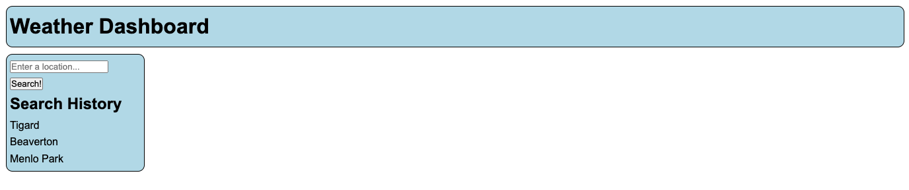
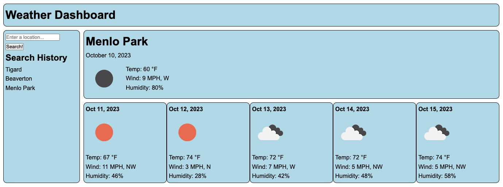

# Weather Dashboard

## Description 

For this project, I was tasked to retrieve weather data from [OpenWeather](https://openweathermap.org/) using their free API. This required three separate fetch requests. The first request converted a queried location into lattitude and longitude coordinates. Those coordiates were then used for a current weather request as well as a five-day forecast request.

This project also gave me the opportunity to use a combination of grid and flex elements, as well as dynamically adding multiple elements to the page. This included individual elements for the current weather conditions, as well as adding repeated elements for the five-day forecast cards.

I deployed the application on [GitHub](https://github.com/) [Pages](https://pages.github.com/), and it can be found [here](https://d-a-v-i-d-w-r-i-g-h-t.github.io/weather-dashboard/).

## Installation

N/A

## Usage 

When the application is loaded the user is presented with a searh bar. If any previous searches were performed, they will be loaded and clickable under the Search History heading.

After entering a location and clicking "Search!", the page will fetch the weather data for that location and then present current condtions followed by a five-day forecast. If the search string is new, it will be added to the Search History.

## Credits

I used [Day.js](https://day.js.org/en/) to compare and work with date elements.

I found a great deal of useful information from [OpenWeather](https://openweathermap.org/) for the three different fetch queries I had to perform.

## License

Please refer to the LICENSE in the repo.

---